# #404 synthetic evidence

These captures use committed manufactured QA recipes. No personal database, operator screenshot, or real-data payload is included.

The paired probes use the same case and viewport before and after the change. The baseline application commit is `56eb22467b0705c1516f51af06add59bb93979ce`; the revised application commit is `1a2acbd4d154386a896926508a6114e35bcd28d7`. The manifest records the case names. Raw probe output accompanies the captures.

## Selected Pattern evidence

The `pattern-near-tie` case selects a concrete occurrence. The final probe records 73 selected trace points and two `selected:marker:*` scatter series at both sizes. Its older `markerBearingSeries` field counts only ECharts markLine/markPoint, so it is empty for scatter markers; the full `charts.eventTile` list contains the marker evidence. The revised focal chart renders that occurrence’s trace and markers from the case-file response.

| Viewport | Before | After |
| --- | --- | --- |
| 1280 × 720 | 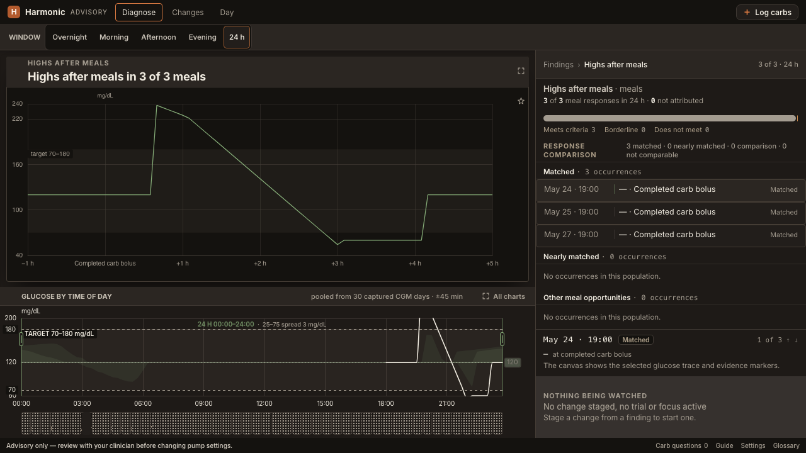 | 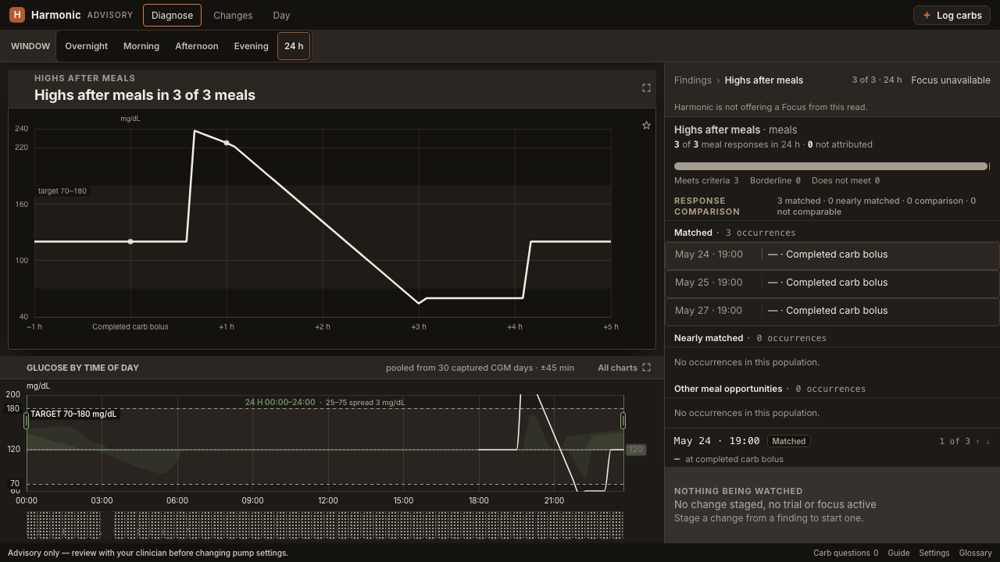 |
| 1440 × 900 | 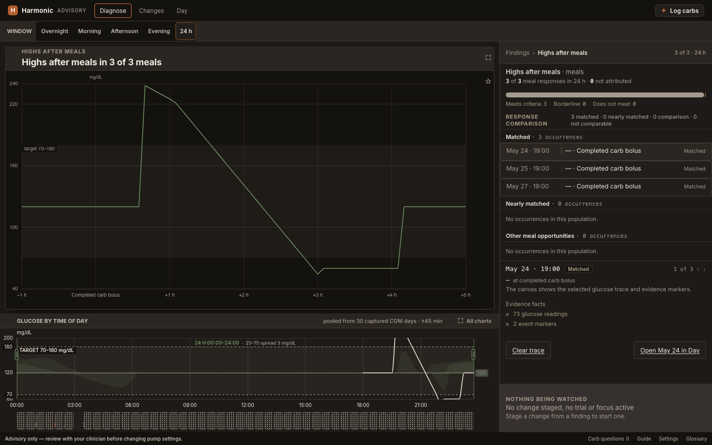 | 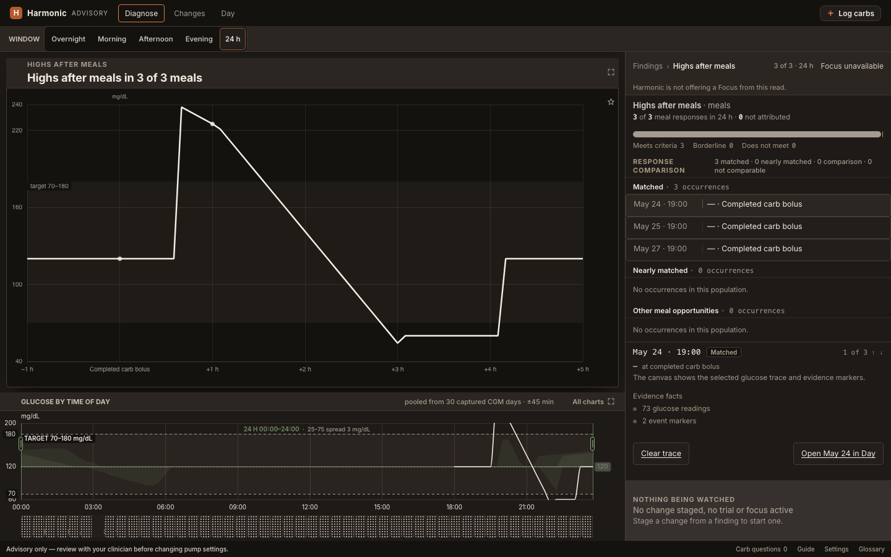 |

## Occurrence rows

The `showcase` case opens the same meal comparison. Group headings now own the constant cohort label, leaving each row’s event description readable. Mixed case rosters retain their varying per-row tiers. The old mealRowGeometry metric requires a per-row tier, so its empty array in the final grouped capture is expected; rendered rows and the new public browser assertions establish the revised layout.

| Viewport | Before | After |
| --- | --- | --- |
| 1280 × 720 | 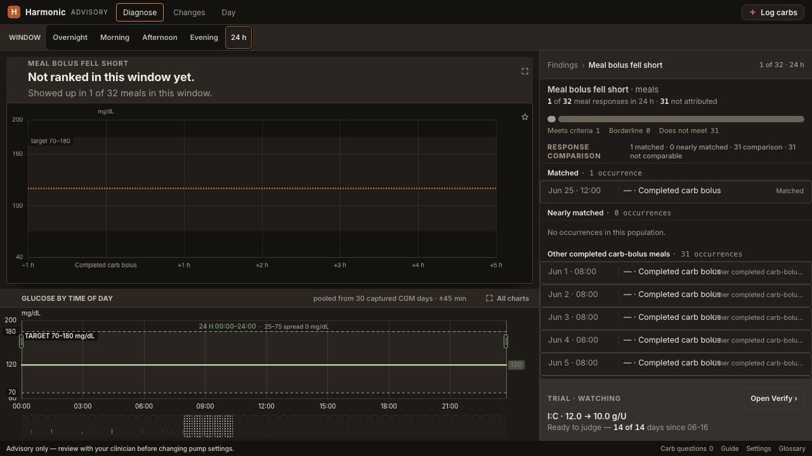 | 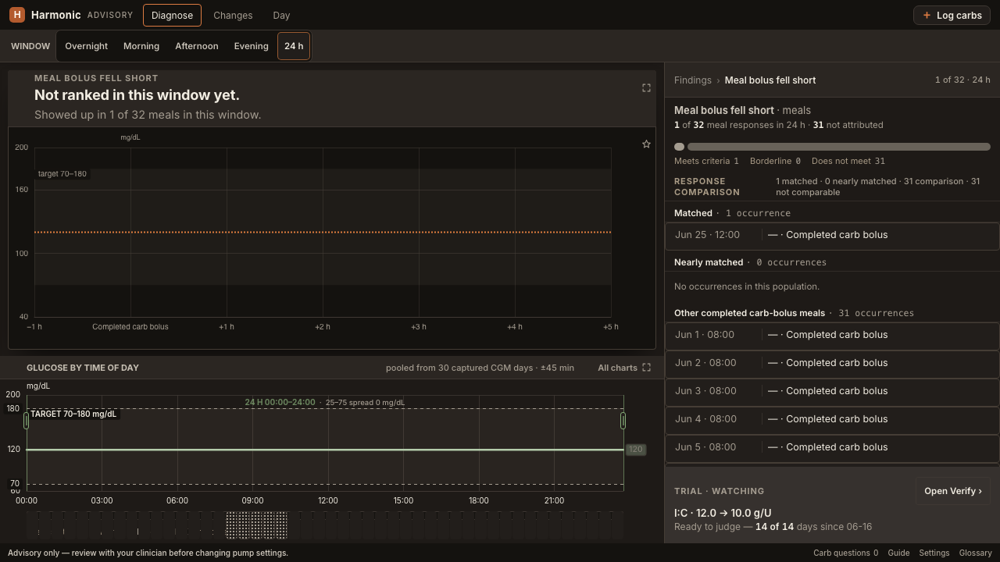 |
| 1440 × 900 | 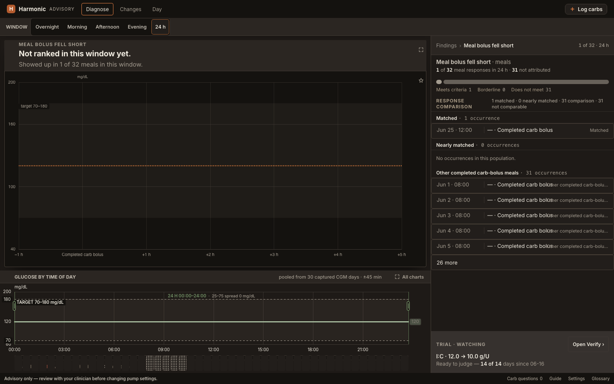 | 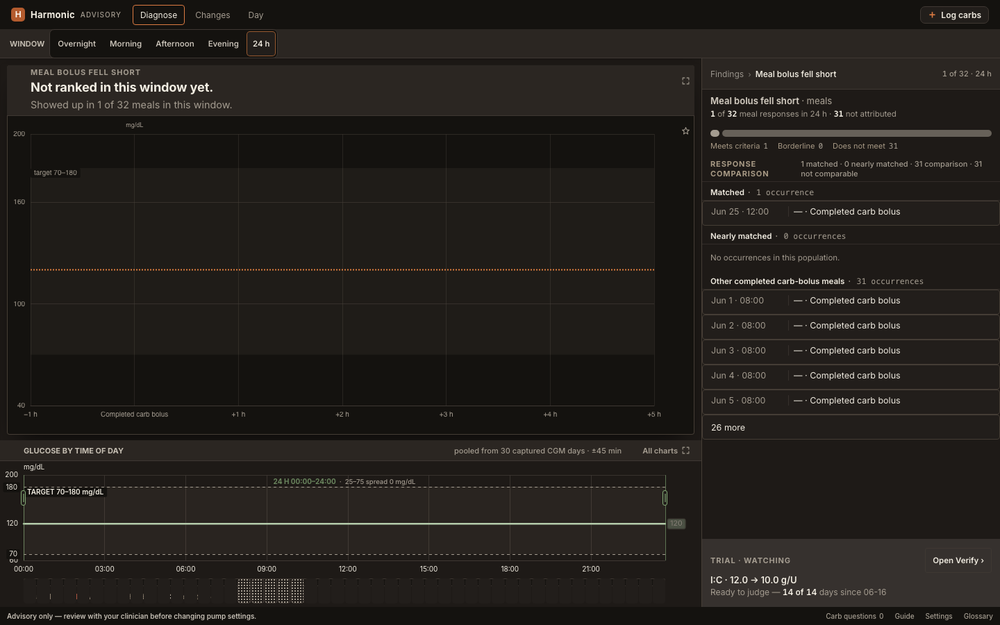 |

## Design corrections and follow-up controls

Opus 5 high inspected 19 revised synthetic screenshots, requested the retained-Day-chart correction, then inspected its two corrected screenshots and marked the design corrections ready. An independent Astra low assessment supplied detector and screenshot evidence. The [baseline critique](design-critique.md), [correction check](opus-design/recheck.md), and [final design verdict](opus-design/final-design-verdict.md) retain the decisions and limitations. The concrete marker-owner exception is documented in the final verdict: a history rail fallback and omission of unknown selected Pattern glucose are different contracts.

The final control gallery is synthetic and records its application commits in [its manifest](opus-design/manifest.json). Filter resting, expanded and loading; Focus read failure, pending Plan and no-route status; grouped rows; Later conclusion; and retained Day loading are captured at both desktop sizes. The separate v1 Filter capture is 1440 × 900.

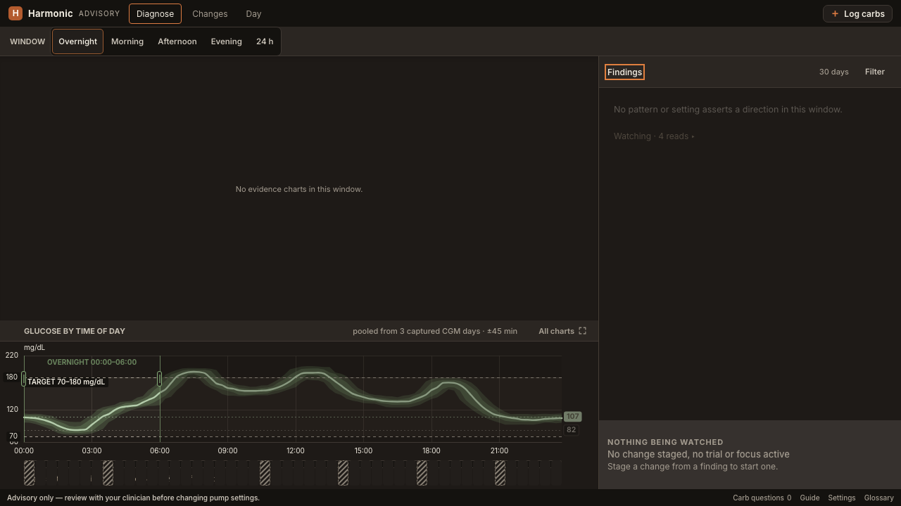

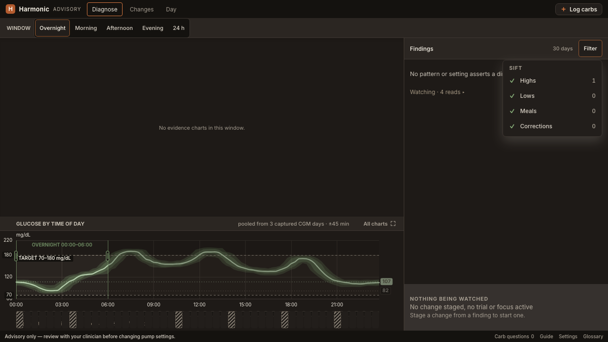

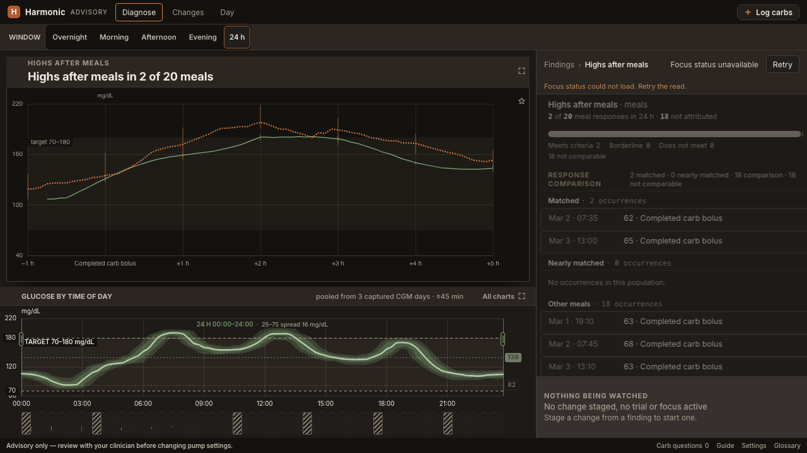

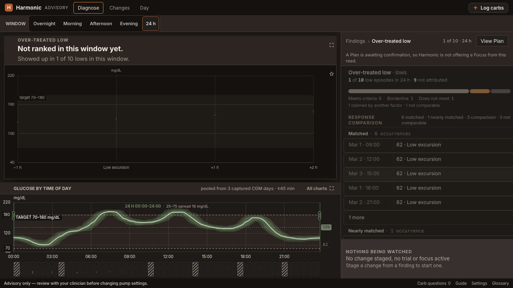

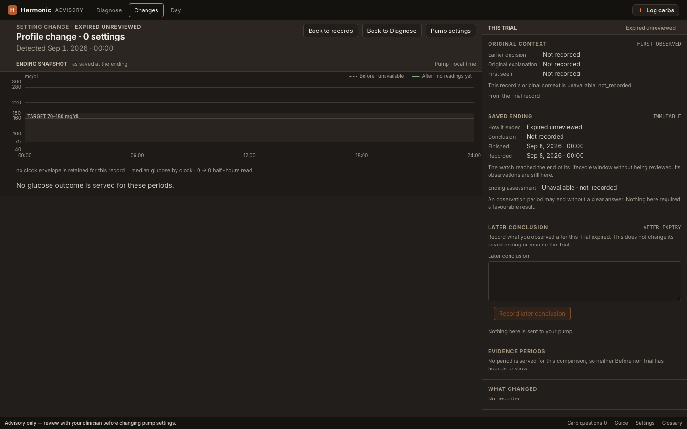

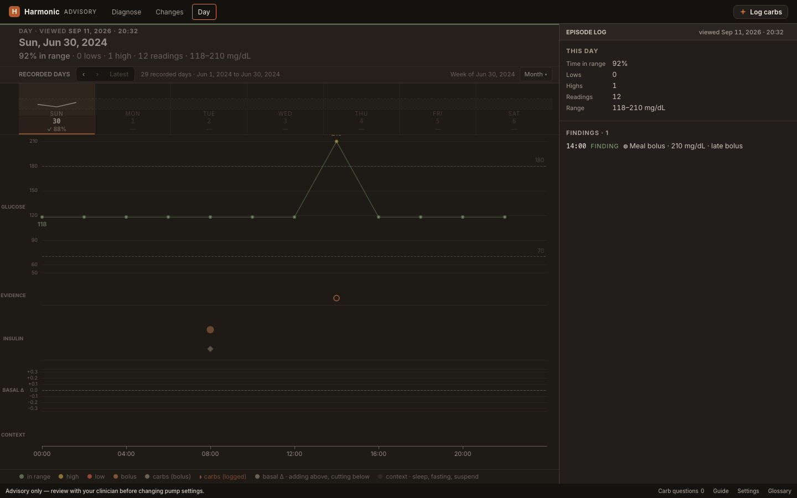

The older Start Focus child and saved-late-conclusion captures are retained as unchanged-control evidence at the earlier commit recorded by the main manifest. They are not the revised design captures.

## Held window drag

An asynchronous evidence repaint could interrupt the held chart’s pointer target. The final correction preserves live preparation and case-file reads while the drag owns overview and brace painting until release. The direct browser regression proves the held pinned refresh and exact 12:00–21:30 endpoint; focused v1 S107 logs preserve both ordinary and wrapped live reads. The v2 focused logs retain real mouse gestures at both sizes.

## Verification

All required local checks passed. The application commit is `1a2acbd4d154386a896926508a6114e35bcd28d7`; the final v2 replay commit is `81cc47de1b1863a729c29e3de2e0ec9d55739650`. Only the S107 driver, its negative contract, and matching ledger wording changed between those commits. See [exact verification](verification.json), [31 non-browser receipts](static-results.json), and [14 browser-leg receipts](browser-results.json). Every receipt retains its actual tested commit and raw log.

* Backend: 2,530 passed, one skipped. Backend code and tests are unchanged since that run.
* Frontend Node: 903 passed.
* Workstation ledger: 168/168 passed.
* V2 ledger: 137/137 selected entries passed at each of 1280 × 720 and 1440 × 900, with zero failures or deferrals. Each run includes 119 active stories and 18 existing sanctioned retirements.
* Build, OpenSpec, guards, generated artifacts, public-tree export, links and contamination checks passed.

The first post-design 1280 run failed only S107's stale assumption that grouped comparison rows repeat their cohort. Its [raw failure](browser-logs/v2-1280-before-s107.log) is retained. The corrected S107 checks exact served group headings and fully readable event text, then real mixed-tier rows from the same showcase and their text/label overlap. Its negative Node cases reject missing headings, clipped text or tiers, and overlapping columns. Focused replay at both sizes and both subsequent full runs passed; no story was retired or waived.

Opus 5 high accepted the design corrections. Final Full review converged in round two: [Standards](final-standards-review.md) holds on all 20 items and [Specification](final-spec-review.md), including its enumeration addendum, meets all 47 checked items. The review used the operator-approved unvalidated Codex-only route with Luna medium. The original mixed baseline is diagnostic evidence, not a waived final failure.
